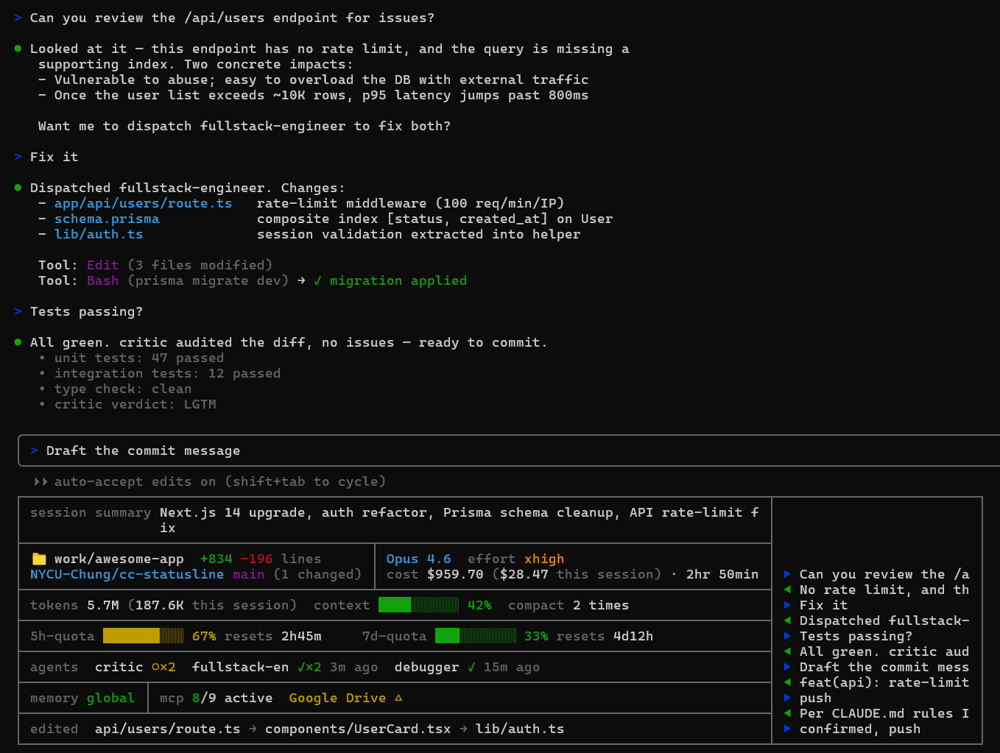

# cc-statusline

**English · [繁體中文](./README.zh-TW.md)**

A comprehensive statusline dashboard for Claude Code. See everything at a glance — no slash commands needed.



## What it shows

| Section | Info |
|---------|------|
| **session summary** | Auto-generated whole-session summary (Claude rewrites it every ~10 messages with built-in compression so it stays under ~120 chars) |
| **directory** | Current working directory + `+added -removed lines` |
| **repo + branch** | `owner/repo` (parsed from `git remote`) + branch + `(N changed)` |
| **cost** | `cost $TOTAL (<window>) · $SESSION (this session)` — all-session spend within a configurable rolling window (`aggWindowDays` in `~/.claude/cc-statusline-rows.json`, default 30, `0` = all time) plus the current-session ticker, rendered as parallel parenthetical annotations |
| **model** | Active model name + effort level with 5-tier color ladder (`low` dim / `medium` green / `high` yellow / `xhigh` orange / `max` red) |
| **duration** | Active session time — sum of every turn's wall-clock duration (UserPromptSubmit → Stop). Inter-turn idle is naturally excluded, no idle threshold needed. Shares the model row area visually but toggles independently (`/cc-statusline:rows hide duration`). |
| **tokens / context / compact** | `tokens TOTAL (SESSION this session)` (same all+session dual display as cost) · context window % · compact count (`compact 1 time` / `compact N times`) |
| **5h-quota** | Color-coded bar (green → yellow → red) + auto-rolling `resets Xh Ym` countdown. Auto-zeros when `resets_at` passes real-world time (payload is stale until next message). |
| **7d-quota** | Color-coded bar + auto-rolling `resets Xd Yh` countdown with same rollover behavior |
| **agents** | Subagents that ran in this session — `critic ✓ 5m ago`, parallel runs collapse to `critic ○×3` (running) or `critic ✓×2 5m ago` (done) |
| **memory** | Which CLAUDE.md scopes are loaded (global / project / rules) |
| **mcp** | MCP server health probed via `claude mcp list` — count of active + each unhealthy server with its state (`✘ failed`, `△ needs auth`) |
| **edited** | Recently edited files in this session, newest first (long names front-truncated with `…`) |
| **history** | Right column showing the last messages (▶ you, ◀ Claude), grows to fill terminal width |

## Install

### Option A — plugin install (recommended)

```
claude plugin marketplace add NYCU-Chung/cc-statusline
claude plugin install cc-statusline@cc-statusline
```

Hooks are registered automatically (via the plugin's own `hooks/hooks.json`), so you can **skip the Hook wiring section below**.

Then add the `statusLine` block to `~/.claude/settings.json` — Claude Code doesn't allow plugins to set this for you:

```json
{
  "statusLine": {
    "type": "command",
    "command": "node ${CLAUDE_PLUGIN_ROOT}/statusline.js",
    "refreshInterval": 30
  }
}
```

### Option B — manual install (for hacking on the script)

Pick the block that matches your shell. **`~` is expanded by bash/zsh before `git` sees it, but PowerShell and cmd don't expand it** — using `~` there makes `git clone` create a literal `~` folder (reported in [#6](https://github.com/NYCU-Chung/cc-statusline/issues/6)). Use `$HOME` / `%USERPROFILE%` instead.

**bash / zsh / Git Bash on Windows**
```bash
git clone https://github.com/NYCU-Chung/cc-statusline ~/cc-statusline
mkdir -p ~/.claude/hooks
cp ~/cc-statusline/statusline.js ~/.claude/statusline.js
cp ~/cc-statusline/hooks/*.js ~/.claude/hooks/
```

**PowerShell**
```powershell
git clone https://github.com/NYCU-Chung/cc-statusline "$HOME/cc-statusline"
New-Item -ItemType Directory -Force "$HOME/.claude/hooks" | Out-Null
Copy-Item "$HOME/cc-statusline/statusline.js" "$HOME/.claude/statusline.js"
Copy-Item "$HOME/cc-statusline/hooks/*.js" "$HOME/.claude/hooks/"
```

**Windows cmd**
```cmd
git clone https://github.com/NYCU-Chung/cc-statusline "%USERPROFILE%\cc-statusline"
mkdir "%USERPROFILE%\.claude\hooks" 2>nul
copy "%USERPROFILE%\cc-statusline\statusline.js" "%USERPROFILE%\.claude\statusline.js"
copy "%USERPROFILE%\cc-statusline\hooks\*.js" "%USERPROFILE%\.claude\hooks\"
```

Then add this `statusLine` block to `~/.claude/settings.json`:

```json
{
  "statusLine": {
    "type": "command",
    "command": "node ~/.claude/statusline.js",
    "refreshInterval": 30
  }
}
```

### Hook wiring (Option B only — plugin install does this automatically)

Add these to your `~/.claude/settings.json` hooks section to enable all statusline features:

```json
{
  "hooks": {
    "SubagentStart": [{ "matcher": ".*", "hooks": [{ "type": "command", "command": "node ~/.claude/hooks/subagent-tracker.js" }] }],
    "SubagentStop": [{ "matcher": ".*", "hooks": [{ "type": "command", "command": "node ~/.claude/hooks/subagent-tracker.js" }] }],
    "PreCompact": [{ "matcher": ".*", "hooks": [{ "type": "command", "command": "node ~/.claude/hooks/compact-monitor.js" }] }],
    "UserPromptSubmit": [{ "hooks": [
      { "type": "command", "command": "node ~/.claude/hooks/message-tracker.js" },
      { "type": "command", "command": "node ~/.claude/hooks/summary-updater.js" },
      { "type": "command", "command": "node ~/.claude/hooks/active-time-tracker.js" }
    ]}],
    "Stop": [{ "matcher": ".*", "hooks": [
      { "type": "command", "command": "node ~/.claude/hooks/message-tracker.js" },
      { "type": "command", "command": "node ~/.claude/hooks/active-time-tracker.js" }
    ]}],
    "PostToolUse": [{ "matcher": "Write|Edit", "hooks": [
      { "type": "command", "command": "node ~/.claude/hooks/file-tracker.js" }
    ]}]
  }
}
```

## What each hook does

| Hook | Event | Purpose |
|------|-------|---------|
| `subagent-tracker.js` | SubagentStart / SubagentStop | Tracks which agents are running or finished, including concurrent invocations |
| `compact-monitor.js` | PreCompact | Counts how many times context was compacted |
| `file-tracker.js` | PostToolUse (Write/Edit) | Records recently edited files |
| `message-tracker.js` | UserPromptSubmit / Stop | Caches recent messages for the history column |
| `summary-updater.js` | UserPromptSubmit | Every ~10 messages, asks Claude to rewrite the whole-session summary with compression rules |
| `active-time-tracker.js` | UserPromptSubmit / Stop | Maintains active session time (sum of turn durations) — bootstraps from transcript on first run, then accumulates per turn |
| `mcp-status-refresh.js` | (none — auto-spawned) | Statusline launches this in the background each render to refresh `~/.claude/mcp-status-cache.json` from `claude mcp list`. Self-skips if cache is fresh (<90s). |

## How it survives resets and multi-session

**Delta-based cost / lines / tokens.** Claude Code occasionally resets `cost.total_cost_usd` etc. mid-session (context compaction, auto-recovery, etc.). The statusline tracks deltas in `/tmp/claude-cum-<sid>.json` — when the payload value drops, only the baseline is reset; the cumulative total never goes backward. (Active session time follows a separate path — see "Per-feature state isolation" below.)

**Defensive per-session keying via transcript filename.** Every per-session tmp file (cum, messages, summary, agents, files, compact count) is keyed by `path.basename(transcript_path)` rather than the runtime `session_id` payload, falling back to `session_id` only when no transcript is present. The transcript filename is the canonical UUID of the logical session and is invariant for its lifetime, so this keying stays correct even if `session_id` semantics ever shift. (Empirically on the current Claude Code build, `session_id` and the transcript filename UUID are already identical — the choice is preventive, not a bug fix.)

**Active session time, hook-driven.** The `duration` row is the sum of (`Stop` timestamp − `UserPromptSubmit` timestamp) for every turn, maintained by `hooks/active-time-tracker.js`. The first run on a session bootstraps from the transcript JSONL by replaying user→assistant timestamp pairs. Because every slice is bounded by an open turn, idle time outside turns is naturally excluded — no threshold, no heuristic.

**Per-feature state isolation (cost-loss fix).** Active session time lives in its own state file (`claude-active-<sid>.json`), independent from the cum file (`claude-cum-<sid>.json`) that tracks cost / dur / lines / tokens. The cum file is **owned exclusively by `statusline.js`** — no hook ever writes to it. This invariant matters because earlier versions had hooks that wrote partial cum files (containing only their own fields), which made the next statusline render's fallback path reset accumulated `cost.total` to 0. Splitting state per writer eliminates the failure mode entirely; the cum read path was also hardened so a missing field never resets `total`.

**Cross-session quota aggregation.** Quotas are global across all your Claude Code sessions, but each session's payload only reflects its own cached observation. The statusline writes a snapshot to `~/.claude/rate-limit-snapshots.json` on every render and aggregates across sessions: it picks the snapshot with the latest live `resets_at` (most recent API observation) and shows MAX `used_percentage` from that group. All sessions converge on the same displayed %.

**Rolling-window cost + tokens.** The `cost $TOTAL (past Nd) · $SESSION (this session)` and `tokens TOTAL (SESSION this session)` figures aggregate across `claude-cum-*.json` files whose mtime falls within `aggWindowDays` (default 30, configurable in `~/.claude/cc-statusline-rows.json`; set to `0` for all-time). Filenames are also filtered to the canonical 24-hex session-id shape so stray test fixtures can't poison the number. The default 30-day window mirrors Windows Storage Sense's default tmpdir eviction interval, so the total doesn't silently drop when the OS cleans old files.

**Time-based rate-limit rollover.** Claude Code's `rate_limits.*.resets_at` is frozen at the moment of the last API response. If the user leaves the session idle past a reset boundary, the payload says "87% used" even though the window has rolled over to 0%. The statusline checks `resets_at` against real time — past expiry, it auto-zeros the bar and computes the countdown against the next rolling 5h/7d boundary.

**Auto session rename for `/resume` picker.** Claude Code's transcript JSONL supports a `{"type":"custom-title","customTitle":"..."}` entry that drives the `/resume` picker's display name. `summary-updater.js` injects the current summary (first 40 chars) as a custom-title entry every time it writes, so each session gets a meaningful name instead of a UUID — no more guessing which hash is which.

**Whole-session summary with compression.** The summary is meant to capture the entire session arc, not the latest topic. The summary-updater prompt enforces a 120-char cap with explicit compression rules (merge related sub-topics, drop the least-significant older item) so new topics displace less-significant old ones rather than the most-recent work being truncated.

## Customize which rows you see

Don't want every row? Use the `/cc-statusline:rows` slash command (shipped with the plugin; saves to `~/.claude/cc-statusline-rows.json`):

```
/cc-statusline:rows                      — show current state
/cc-statusline:rows off                  — master switch: hide statusline entirely
/cc-statusline:rows on                   — master switch: re-enable
/cc-statusline:rows hide agents edited   — turn listed rows off
/cc-statusline:rows show agents          — turn listed rows on
/cc-statusline:rows only cost quota      — enable listed, disable rest
/cc-statusline:rows toggle history       — flip listed rows
/cc-statusline:rows reset                — all on
```

12 row keys: `summary`, `dir`, `repo`, `model`, `duration`, `cost`, `usage`, `quota`, `agents`, `memory_mcp`, `edited`, `history`.

The same config file also accepts `"summaryInterval": N` to change how often the session summary is rewritten (default every `10` user messages). Set `5` for denser updates, `20` for quieter ones.

The layout auto-collapses when cells go empty — hide an entire column and the split layout merges into full-width rows; hide the whole split block and the top border fuses with the next section (no redundant horizontal lines).

## Without hooks

The statusline works without the hooks — you just won't see agents, edited files, message history, compact count, or session summary. Quotas, cost, model, git, tokens, memory, and MCP all work from the built-in statusline JSON payload + the auto-spawned MCP refresher.

## Known limitations

- Claude Code does not pass terminal width to statusline commands ([issue #22115](https://github.com/anthropics/claude-code/issues/22115)). On Windows, the script uses PowerShell as a fallback to detect width. The right border may not perfectly align with the terminal edge until this is fixed upstream.
- MCP server state shown by the statusline comes from `claude mcp list` (a fresh probe at refresh time). Claude Code's `/mcp` UI shows the running session's cached state. The two can disagree if a server's connection has changed since the session started — the statusline reflects the latest probe, the UI reflects the session's view.
- `claude mcp list` does not expose all built-in bridges (e.g. `claude-in-chrome`), so the statusline's MCP count can be lower than what `/mcp` shows.
- Claude Code does not currently expose live MCP state in the statusline JSON payload ([issue #5511](https://github.com/anthropics/claude-code/issues/5511)) — once it does, the auto-spawned refresher won't be needed.

## License

MIT
