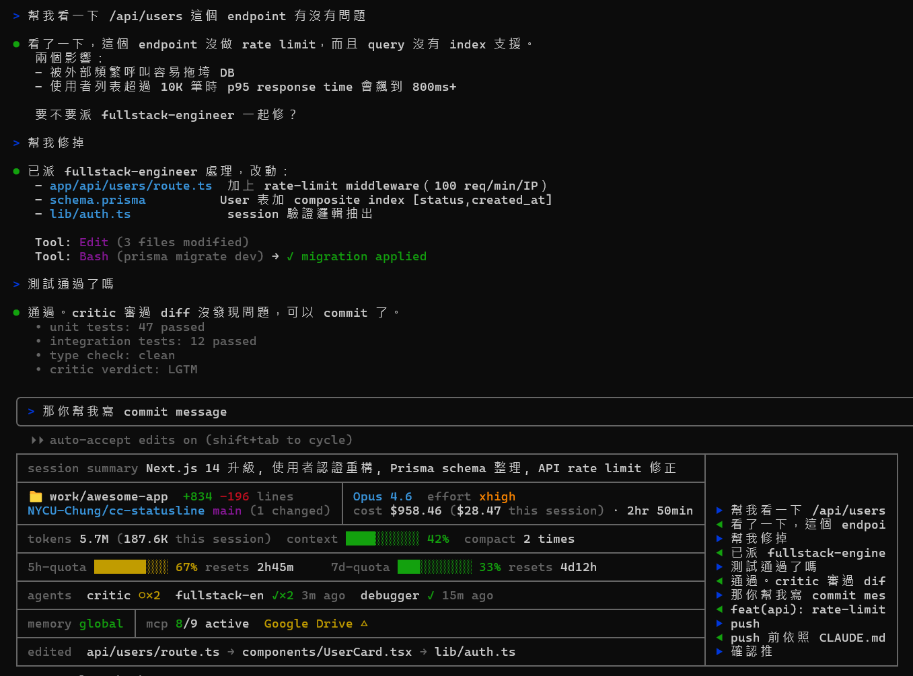

# cc-statusline

**[English](./README.md) · 繁體中文**

Claude Code 的完整 statusline 儀表板。所有資訊一目瞭然 — 不再需要斜線指令。



## 顯示的資訊

| 區塊 | 內容 |
|------|------|
| **session** | 自動生成的 session 摘要（Claude 每 ~10 則訊息更新一次） |
| **directory** | 當前工作目錄 + git branch + 未 commit 檔案數 |
| **model** | 當前模型名稱、session 成本、持續時間、thinking effort 等級 |
| **code** | 新增/刪除行數、累計 token 消耗、context 壓縮次數 |
| **quotas** | Context window、5h 配額、7d 配額 — 各附顏色進度條（綠 → 黃 → 紅）+ 5h 重置倒數 |
| **agents** | 最近的 subagent 狀態 — ✓ 完成（附幾分鐘前）或 ○ 執行中 |
| **memory** | 目前載入的 CLAUDE.md 範圍（global / project / rules） |
| **mcp** | MCP server 健康狀態 — 幾個活著、哪些掛了 |
| **edited** | 這個 session 最近編輯的檔案，新到舊 |
| **history** | 右欄顯示最近 7 則對話（▶ 你、◀ Claude） |

## 安裝

### 一鍵安裝（plugin）

```
claude plugin marketplace add NYCU-Chung/cc-statusline
claude plugin install cc-statusline@cc-statusline
```

Hooks 會自動註冊。你只需要手動加入 statusLine 設定：

在 `~/.claude/settings.json` 加入：

```json
{
  "statusLine": {
    "type": "command",
    "command": "node ~/.claude/statusline.js",
    "refreshInterval": 30
  }
}
```

然後複製檔案：

```bash
git clone https://github.com/NYCU-Chung/cc-statusline ~/cc-statusline

# 主腳本
cp ~/cc-statusline/statusline.js ~/.claude/statusline.js

# 輔助 hooks（可選但建議安裝 — 它們把資料餵給 statusline）
cp ~/cc-statusline/hooks/*.js ~/.claude/hooks/
```

### Hook 接線

在 `~/.claude/settings.json` 的 hooks 區段加入以下設定，啟用完整 statusline 功能：

```json
{
  "hooks": {
    "SubagentStart": [{ "matcher": ".*", "hooks": [{ "type": "command", "command": "node ~/.claude/hooks/subagent-tracker.js" }] }],
    "SubagentStop": [{ "matcher": ".*", "hooks": [{ "type": "command", "command": "node ~/.claude/hooks/subagent-tracker.js" }] }],
    "PreCompact": [{ "matcher": ".*", "hooks": [{ "type": "command", "command": "node ~/.claude/hooks/compact-monitor.js" }] }],
    "UserPromptSubmit": [{ "hooks": [
      { "type": "command", "command": "node ~/.claude/hooks/message-tracker.js" },
      { "type": "command", "command": "node ~/.claude/hooks/summary-updater.js" }
    ]}],
    "Stop": [{ "matcher": "*", "hooks": [
      { "type": "command", "command": "node ~/.claude/hooks/message-tracker.js" }
    ]}],
    "PostToolUse": [{ "matcher": "Write|Edit", "hooks": [
      { "type": "command", "command": "node ~/.claude/hooks/file-tracker.js" }
    ]}]
  }
}
```

## 每個 hook 的功能

| Hook | 事件 | 用途 |
|------|------|------|
| `subagent-tracker.js` | SubagentStart / SubagentStop | 追蹤哪些 agent 在跑或已完成 |
| `compact-monitor.js` | PreCompact | 計數 context 壓縮次數 |
| `file-tracker.js` | PostToolUse (Write/Edit) | 記錄最近編輯的檔案 |
| `message-tracker.js` | UserPromptSubmit / Stop | 快取最近的對話供歷史欄顯示 |
| `summary-updater.js` | UserPromptSubmit | 每 ~10 則訊息請 Claude 寫一句 session 摘要 |

## 不裝 hooks

Statusline 不裝 hooks 也能用 — 只是看不到 agents、編輯檔案、訊息歷史、壓縮次數和 session 摘要。配額、成本、模型、git、token、memory、MCP 這些都從 Claude Code 內建的 statusline JSON payload 取得。

## 已知限制

Claude Code 目前不會把終端機寬度傳給 statusline 指令（[issue #22115](https://github.com/anthropics/claude-code/issues/22115)）。在 Windows 上，腳本用 PowerShell 作為 fallback 偵測寬度。在上游修復之前，右邊框線可能無法完美貼齊終端機邊緣。


## License

MIT
